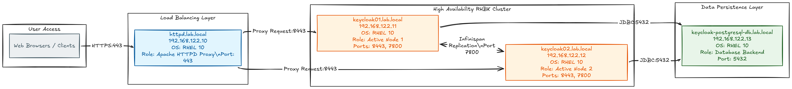

# Red Hat build of Keycloak Laboratory Automation

[](https://docs.ansible.com/)
[](https://www.redhat.com/en/technologies/linux-platforms/enterprise-linux)

Automated Ansible playbooks for deploying a High-Availability (HA) **Red Hat Build of Keycloak (RHBK)** environment on Red Hat Enterprise Linux.

## Architecture Overview

The lab consists of 4 dedicated RHEL servers configured in a highly available, load-balanced layout:



## Topology & Network Specifications

| Hostname | IP Address | OS | Role | Primary Ports |
| :--- | :--- | :--- | :--- | :--- |
| `control-node` | `192.168.122.1` | - | Ansible Execution Environment Node | - |
| `httpd.lab.local` | `192.168.122.10` | RHEL 10 | Reverse Proxy / Load Balancer (Apache HTTPD) | 443 |
| `keycloak01.lab.local` | `192.168.122.11` | RHEL 10 | RHBK Active Node 1 | 8080, 7800, 9000 |
| `keycloak02.lab.local` | `192.168.122.12` | RHEL 10 | RHBK Active Node 2 | 8080, 7800, 9000 |
| `keycloak-postgresql-db.lab.local` | `192.168.122.13` | RHEL 10 | Database Backend (PostgreSQL) | 5432 |

## Prerequisites

Ensure the following tooling is installed on your control node prior to execution:

- **[Ansible](https://docs.ansible.com/ansible/latest/installation_guide/index.html)** (2.15+)
- **[Ansible Navigator](https://ansible.readthedocs.io/projects/navigator/installation)** (1.1.0+)
- **[Podman](https://podman.io/)** (4.0+) - for running execution environments
- **Python 3.11+** on the control node
- **SSH connectivity** to all target hosts

### Required Ansible Collections

The playbook uses the following collections (automatically pulled from requirements.yaml):

- `redhat.rhel_system_roles` (v1.120.5) - RHEL system configuration
- `redhat.rhbk` (v3.0.2) - Red Hat Build of Keycloak deployment
- `community.postgresql` - PostgreSQL database management

Install collections by running:

```bash
ansible-galaxy collection install -r collections/requirements.yaml -p collections/
```

## Configuration Requirements

Before running the playbook, you must configure the following:

### 1. Inventory Configuration

Update the `inventory` file to match your target environment. Change the IP addresses and hostnames according to your infrastructure.

**Note:** Ensure all hosts are reachable via SSH and have passwordless sudo configured or valid sudo credentials.

### 2. Privilege Escalation Password

The playbook requires `sudo` privileges on remote hosts. Create a `devops_become_password` file:

```bash
echo "your_sudo_password" > devops_become_password
chmod 600 devops_become_password
```

This file is referenced in `ansible.cfg` and contains the sudo password for the `devops` user.

### 3. Ansible Navigator Configuration

The `ansible-navigator.yml` file configures the execution environment:

- **Container Engine:** Podman (ensure it's running)
- **Execution Environment:** `registry.redhat.io/ansible-automation-platform-25/ansible-dev-tools-rhel8:latest`
- **Pull Policy:** `missing` (pulls image only if not present locally)

For offline execution, you may need to pre-pull the image:

```bash
podman pull registry.redhat.io/ansible-automation-platform-25/ansible-dev-tools-rhel8:latest
```

### 6. Network

| Hostname | IP Address | OS | Role | Primary Ports |
| :--- | :--- | :--- | :--- | :--- |
| `control-node` | `192.168.122.1` | | Run the ansible automation code | |
| `httpd.lab.local` | `192.168.122.10` | RHEL 10 | Reverse Proxy / Load Balancer (Apache HTTPD) | 443 |
| `keycloak01.lab.local` | `192.168.122.11` | RHEL 10 | RHBK Active Node 1 | 8080, 7800, 9000 |
| `keycloak02.lab.local` | `192.168.122.12` | RHEL 10 | RHBK Active Node 2 | 8080, 7800, 9000 |
| `keycloak-postgresql-db.lab.local` | `192.168.122.13` | RHEL 10 | Database Backend (PostgreSQL) | 5432 |


### 7. SSH Configuration

Ensure SSH access to all hosts with the `devops` user:

```bash
# Test SSH connectivity
ansible all -i inventory -m ping
```

If using SSH keys instead of passwords, configure them in the inventory or `~/.ssh/config`.

## Running the Playbook

### Prerequisites Checklist

Before execution, verify all the following are complete:

- [ ] `inventory` file updated with correct hostnames and IP addresses
- [ ] `devops_become_password` file created and set with appropriate permissions
- [ ] `keycloak-vault-pass` file created
- [ ] `group_vars/keycloak/main.yaml`, `group_vars/database/main.yaml`, and `group_vars/load_balancer/main.yaml` customized for your environment
- [ ] Certificates `keycloak.lab.local.crt` and `keycloak.lab.local.key` in files match the host
```
openssl req -x509 -newkey rsa:4096 -sha256 -days 365 -noenc -keyout keycloak.lab.local.key -out keycloak.lab.local.crt -subj "/C=US/ST=State/L=City/O=Organization/OU=Department/CN=keycloak.lab.local" -addext "subjectAltName=DNS:keycloak.lab.local,IP:192.168.122.10"
```
- [ ] SSH connectivity verified with `ansible all -i inventory -m ping`

### Execution

Run the playbook using Ansible Navigator:

```bash
ansible-navigator run playbook.yaml
```

Or using traditional Ansible:

```bash
ansible-playbook playbook.yaml -i inventory
```

### What the Playbook Does

The main playbook executes the following phases in order:

1. **pre-setup.yaml** - System preparation (update packages, allow sudo without a password and configure /etc/hosts)
2. **postgresql.yaml** - Database installation and initialization
3. **rhbk.yaml** - RHBK installation and cluster configuration
4. **httpd.yaml** - Apache HTTPD reverse proxy and SSL setup

### Troubleshooting

For detailed debugging, enable verbose mode:

```bash
ansible-navigator run playbook.yaml -i inventory -vvv
```

Use systemd to check service status:

```bash
ansible keycloak -i inventory -m systemd -a "name=rhbk state=started"
ansible database -i inventory -m systemd -a "name=postgresql state=started"
ansible load_balancer -i inventory -m systemd -a "name=httpd state=started"
```